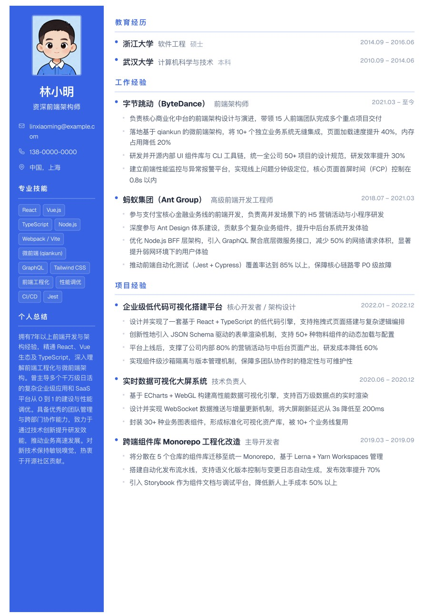

<div align="center">

# CVPilot

**一款轻量、优雅的在线简历编辑器，支持 A4 实时预览与一键导出 PDF。**

[English](./README.md)

<br />


<br /><br />



</div>

---

## ✨ 功能亮点

- **两套内置模版** —— Classic 单栏经典版、Modern 双栏现代版，一键切换
- **所见即所得** —— A4 实时预览，编辑即渲染，像素对齐真实纸张
- **智能 PDF 导出** —— 内容不满一页时自动均分间距，完美适配 A4
- **数据本地化** —— 全部存储在浏览器 `localStorage`，不上传任何服务器
- **本地头像上传** —— 直接选择文件，读取为 base64 内联保存
- **模块显隐** —— 任意模块可按需隐藏，定制专属简历
- **零注册零后端** —— 纯静态 Next.js 应用，哪里都能部署

## 🧰 技术栈

- **框架**：Next.js 16（App Router, Turbopack）
- **UI**：React 19 · TypeScript 5 · Tailwind CSS 4
- **工具链**：ESLint 9

## 🚀 快速开始

```bash
# 安装依赖
npm install

# 本地开发
npm run dev       # http://localhost:3000

# 生产构建
npm run build
npm run start

# 代码检查
npm run lint
```

## 📁 目录结构

```
app/              # Next.js App Router 入口 & API 路由
features/         # 业务功能模块
  resume-builder/ # 顶层 Shell
  resume-editor/  # 编辑器表单
  resume-preview/ # A4 预览 & 模板
components/ui/    # 通用 UI 原子组件
lib/              # 工具函数、常量、存储、打印
types/            # 共享类型定义
```

## 🖨️ 导出 PDF

点击右上角 **导出 PDF**，CVPilot 会自动：

1. 隐藏所有非简历区域
2. 测量内容高度
3. 若内容不满一页，自动拉伸 section 间距至填满 A4
4. 调起浏览器打印面板 —— 选择「另存为 PDF」即可

> 小贴士：Chrome 打印对话框里取消勾选「页眉和页脚」，可获得最干净的输出。

## 🗺️ 路线图

- [ ] AI 文案润色（接入 OpenAI / Claude / DeepSeek）
- [ ] 更多模板（极简、左侧栏、学术）
- [ ] 从 JSON / JSON Resume schema 导入
- [ ] 多语言简历支持

## 🤝 参与贡献

欢迎提交 Issue 和 PR！如果 CVPilot 对你有帮助，欢迎点一个 Star ⭐

## 📄 许可证

MIT © CVPilot contributors
